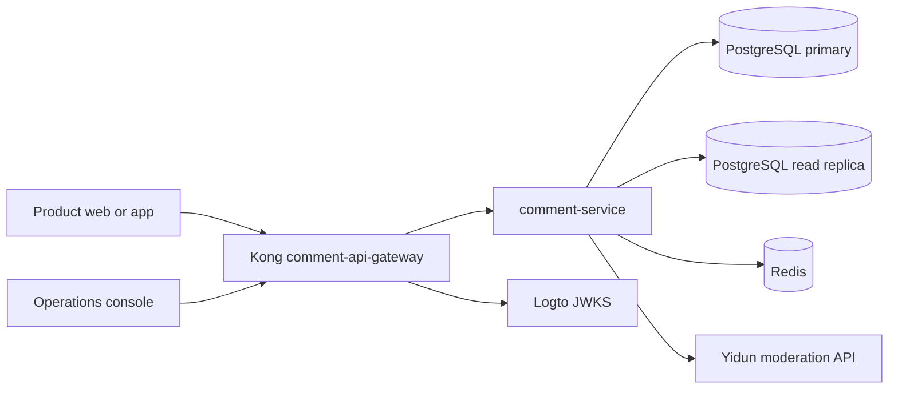

# Technical Design: Comment Service v1

## Purpose

This document turns the approved product decisions into an implementable system. The backend uses Kong as `comment-api-gateway` and a `comment-service` that owns all domain behavior. The system exposes two HTTP API surfaces:

- Public API: consumed by product web and app clients on behalf of authenticated users.
- Console API: consumed by the responsive operations console on behalf of authenticated operators.

Both surfaces require an application key. The API never owns article pages or canonical URL routing; it returns a globally unique comment ID for the consuming product to use.

## Architecture

Kong is configured declaratively as `comment-api-gateway`. It owns only edge concerns: route forwarding, JWT/JWKS validation, CORS, request IDs, payload limits, and coarse edge rate limiting. Kong uses its Redis-backed rate-limit plugin so limits remain correct across gateway instances. Kong has no domain logic and does not access PostgreSQL or Yidun. `comment-service` emits the shared error envelope.

`comment-service` is a NestJS modular monolith for v1. It owns every domain decision, authorization against application state and blocks, transactions, cache invalidation, audit writes, and all PostgreSQL, Redis, and Yidun access.

## Request Identity And Authorization

Every request supplies `X-Application-Key`. The application guard resolves it before any resource lookup. Application keys are public routing identifiers and may be embedded in product clients; they are not credentials.

- Unknown application keys return `404`.
- Creating an application with an existing slug returns `409 Conflict` with error code `slug_taken`; the service never auto-renames a slug.
- Disabled applications return `404` from the public API. Console APIs remain available so operators can inspect and re-enable their data. Re-enabling restores public API access without changing application data, key, or slug. Both disable and re-enable actions create immutable audit records.
- Public API requires a membership-issued bearer JWT. The `MemberIdentityProvider` adapter verifies its signature against the membership system JWKS and reads `memberId` from `accountId`, the author nickname from `name`, API `avatarUrl` from the source `avaterUrl` claim, and registration timestamp from `createdAt`, an ISO 8601 UTC string. No membership-profile lookup is required.
- Console API validates Logto OIDC JWTs against its JWKS and uses the JWT `sub` as `operatorId`. Every valid operator has the same permission set.
- In `local` only, console authentication also supports a seeded PostgreSQL operator account. Its password is stored only as a bcrypt hash; a local-only login endpoint exchanges valid username/password credentials for a short-lived operator JWT. A separate local-only issue-token endpoint can issue a short-lived member JWT only for one of the fixed seeded test users. These endpoints and local identity provider must fail closed outside `local`.
- A full block causes public read endpoints to return `404` for the comments surface. A normal block permits public reads but rejects every public mutation: comment creation, reactions, triple reactions, reports, and mute changes.

Membership JWT issuer, audience, JWKS URL, and signing algorithm are required deployment configuration and remain open. Tests use a deterministic fake `MemberIdentityProvider` adapter.

## Core Modules

| Module | Responsibility |
| --- | --- |
| `applications` | Create, list, rename, disable applications and validate keys/slugs. |
| `comments` | Create, list, branch pagination, lifecycle visibility, and deletion placeholders. |
| `reactions` | Emoji toggle and one-time triple reaction. |
| `moderation` | Synchronous Yidun review and pending approval/rejection. |
| `safety` | Mute, report, auto-ban calculation, and block enforcement. |
| `console` | Search, bulk deletion, operator settings, reports, and user statistics. |
| `audit` | Immutable records for operator and automatic moderation actions. |
| `cache` | Redis reads and invalidation for public list and aggregate endpoints. |
| `jobs` | A future asynchronous-work boundary; no queue worker is deployed in v1. |

## Persistence Model

All timestamps are `TIMESTAMPTZ` with millisecond precision. Application keys are UUIDv7 values; comment IDs and other standalone service IDs are ULIDs. Composite primary keys express relationships. `application_id` is present on every application-scoped table.

| Table | Key fields and constraints |
| --- | --- |
| `applications` | `id`, unique `key`, unique immutable `slug`, `name`, `status`, timestamps. |
| `comments` | ULID `id` primary key, `application_id`, `article_key`, nullable `root_comment_id`, `author_id`, author snapshot, `body`, `status`, internal-only `moderation_reason`, nullable author-visible `rejection_code`, timestamps. A child references a root comment only; no third level exists. |
| `comment_reactions` | `(application_id, comment_id, member_id, emoji)` primary key; emoji is constrained to `laugh`, `cry`, or `cheer`. |
| `triple_reactions` | `(application_id, comment_id, member_id)` primary key. Created atomically with the missing reactions. |
| `muted_users` | `(application_id, member_id, muted_member_id)` primary key. |
| `reports` | ULID `id`, application, reporter, comment, reported author, required `reason_category`, timestamp. `reason_category` is one of `spam`, `harassment`, `hate`, `misinformation`, `sexual_content`, or `violence`. `(application_id, reporter_id, comment_id)` is unique; a duplicate submission returns `409 Conflict`. |
| `user_blocks` | `(application_id, member_id)` primary key, mode, source, nullable `expires_at`, auto-ban metadata, timestamps. Authorization treats a block with a past `expires_at` as inactive; no expiry worker is required. |
| `user_offenses` | `(application_id, member_id)` primary key with cumulative trigger count; manual unblocks do not reset it. |
| `application_settings` | `application_id` primary key, interval, daily limit, new-user cooldown, tier thresholds, tier durations, and `yidun_moderation_enabled`. The third threshold also governs the fourth permanent-ban trigger. |
| `application_origins` | `(application_id, origin)` primary key. Approved browser origins for direct public API access. |
| `sensitive_words` | ULID `id`, application, normalized word, timestamps; unique `(application_id, normalized_word)`. |
| `audit_logs` | ULID `id`, application, nullable `operator_id`, action, target type/id, structured metadata including an optional internal operator note, timestamp. |

Required indexes include comment list cursors by `(application_id, article_key, root_comment_id, created_at, id)`, root-comment sorting by application/article/status plus each sort key, pending queue by application/status/created time, and console search indexes. Keyword search uses a PostgreSQL generated `tsvector` column and GIN index; article keys and IDs use B-tree indexes.

Creating an application also creates its `application_settings` row. The default comment interval is one minute, the daily limit is 20 comments per user per UTC+8 day, the new-user cooldown is 24 hours, and Yidun moderation is disabled; the remaining settings defaults are defined below as they are confirmed.

## Comment Lifecycle And Consistency

1. Validate identity, application state, full/normal block state, new-user cooldown, interval, daily quota, parent shape, and content length.
2. In a primary-database transaction, reserve the posting attempt so pending and rejected submissions count toward rate and daily limits.
3. When Yidun moderation is enabled for the application, call Yidun synchronously. A clean result creates a `published` comment; a flagged result creates a `pending` comment. When it is disabled, skip the Yidun call and create every otherwise-valid comment as `published`.
4. Commit the comment, quota state, and applicable audit event, then invalidate application/article cache keys.
5. A console operator transitions a pending comment to `published` or `rejected`. The author alone can retrieve their pending/rejected comments.

An upstream moderation failure returns a retryable `503`; no posting attempt is recorded. This behavior applies only while Yidun moderation is enabled. Comment-creation requests may carry an `Idempotency-Key`; when present, retries return the original result without creating a duplicate or consuming quota twice. Each accepted request without a key is a distinct submission.

Deleting a root comment sets status to `deleted` and hides its body behind the required placeholder; its branch remains listable. The deleted root's emoji reactions no longer contribute to article heat, while its visible child comments still do. Deleting a child comment removes it from public branch results and from its root's reply count and heat. Original bodies are retained permanently and remain available through the console for audit and investigation, but never through public endpoints after deletion. Neither action physically deletes its audit trail.

## Public API Contract

All endpoints below are under `/v1`, require `X-Application-Key`, and require member authentication unless noted.

Public failures use `{ code, message, details }`, where `code` is stable and clients localize display text. `details` carries machine-readable values such as `retryAfterSeconds`, `remainingDailyQuota`, or `cooldownEndsAt`; `message` is diagnostic and not a display contract. Relevant codes include `comment_interval_active`, `daily_comment_limit_exceeded`, `new_user_cooldown_active`, `normal_blocked`, `auto_banned`, and `full_blocked`.

| Method and path | Behavior |
| --- | --- |
| `GET /articles/:articleKey/comments` | Cursor-paginated root comments. Query: `sort=relevant|newest|oldest`, `cursor`, `limit`. Default is `relevant`. |
| `GET /comments/:commentId/branch` | Cursor-paginated children, oldest first. Comment lookup remains scoped to the request application. |
| `POST /articles/:articleKey/comments` | Create a root comment with `{ body }`; accepts an optional `Idempotency-Key` and returns `201 Created`, including `status: pending` when human review is required. |
| `POST /comments/:commentId/replies` | Create a child comment with `{ body }`; accepts an optional `Idempotency-Key` and returns `201 Created`, including `status: pending` when human review is required. |
| `PUT /comments/:commentId/reactions/:emoji` | Toggle one emoji; returns current counts and caller state. |
| `POST /comments/:commentId/triple-reaction` | Add all missing emojis once; returns current counts and caller state. |
| `PUT /users/:memberId/mute` / `DELETE /users/:memberId/mute` | Mute or unmute another member. |
| `POST /comments/:commentId/reports` | Report with required `{ reasonCategory }` and permanently hide the comment from the caller. Self-reports return `422 cannot_report_own_comment`; duplicate reports and reports against operator-deleted comments return `409 Conflict`. |
| `POST /comments/batch` | At most 20 article keys and 3 root comments per article. Returns comments, comment total, and per-emoji totals. |
| `GET /hot-articles` | Cursor-paginated articles ordered by article heat. |

Comment bodies are plain text with line breaks permitted and are limited to 1,000 Unicode grapheme clusters. A body containing only whitespace is rejected; whitespace is otherwise preserved. Comment payloads include `id`, `articleKey`, `rootCommentId`, author display data, body or deletion placeholder, status when visible to the author, per-emoji counts, caller reaction state, reply count, `heat`, and `createdAt`. Rejected comments visible to their author include `rejectionCode`, one of `violates_guidelines`, `spam`, `harassment`, `hate`, `sexual_content`, or `misinformation`; operator notes and Yidun details remain internal.

Emoji toggles and triple reactions are available only for published comments. Pending, rejected, and deleted comments reject reaction requests.

Public cursor-paginated lists default to 20 items and accept at most 50 per request.

## Console API Contract

Console routes live under `/v1/console` and require a valid Logto operator JWT plus `X-Application-Key`, except application creation/listing.

- `POST /applications`, `GET /applications`, `PATCH /applications/:key`
- `GET /comments`, with keyword, article key, status, from/to timestamps, page, and page size
- `GET /comments/:commentId`, `DELETE /comments/:commentId`
- `POST /comments/bulk-delete-by-article`, `POST /comments/bulk-delete-by-user`
- `GET /moderation/pending`, `POST /moderation/comments/:commentId/approve`, `POST /moderation/comments/:commentId/reject` (requires a `rejectionCode`)
- `GET /users`, `GET /users/:memberId/stats`, `PUT /users/:memberId/block`, `DELETE /users/:memberId/block`
- `GET /reports`, `GET /auto-bans`
- `GET /settings`, `PUT /settings`, `GET|PUT /origins`
- `GET|POST|DELETE /sensitive-words`
- `GET /audit-logs`

Console lists use page-based pagination and return `items`, `page`, `pageSize`, and `total`. They default to 20 items and accept at most 50 per request.

Console moderation and enforcement mutations accept an optional internal `note`. It is written to immutable audit metadata and is never exposed through public endpoints.

`PUT /settings` lets an operator enable or disable Yidun moderation for the selected application. Enabling requires valid Yidun credentials and application-specific configuration; until then, the default disabled mode approves all otherwise-valid comments without calling Yidun.

Browser requests to the public API are accepted only from exact scheme-host-port origins on the selected application's allowlist; wildcard subdomains are not supported. This is CORS enforcement for browser clients, not authentication; native app and trusted server clients rely on application key and JWT validation instead.

## Cache And Read Scaling

Redis keys begin with `comment:{applicationKey}:` and include article key, sort, and cursor-independent first-page variant. Cache the published root-comment first page, emoji counters, batch responses, and hot article responses for 30 seconds. Any comment lifecycle change, reaction mutation, report-induced hide state, or relevant settings change invalidates the associated application/article keys.

Writes, quota checks, moderation transitions, reactions, reports, and audit records use PostgreSQL primary transactions. Public and console list reads use the replica only when cache misses are safe to serve; immediately after a caller mutation, the response is returned directly rather than relying on replica visibility.

V1 deploys no separate message queue. Redis is used for caching and Kong's shared edge rate-limit counters; critical domain mutations remain synchronous and PostgreSQL-transactional. User/application posting rules, including the one-minute interval, UTC+8 daily quota, and counting pending or rejected submissions, are enforced by `comment-service` within its primary-database transaction. The `jobs` module is reserved for work that must outlive a request, such as asynchronous moderation, external synchronization retries, notifications, search indexing, analytics, cache warming, or large bulk operations. When that need arrives, use BullMQ backed by the existing Redis deployment before introducing a separate queue platform.

## Test Plan And Delivery Order

Every functional requirement requires both unit coverage of its domain rule and end-to-end coverage of its externally observable HTTP behavior before it is complete. HTTP end-to-end tests are the single behavioral seam for API contracts: they run against PostgreSQL and Redis test containers with fake member identity, fake Logto JWT verification, and a contract-test Yidun stub. Unit tests do not replace end-to-end tests, and UI smoke tests do not replace either.

The CI quality gate runs typecheck, unit tests, service HTTP end-to-end tests through Kong, and Developer Lab component tests (jsdom). Each user story is traceable to at least one unit-test case and one end-to-end test case by its story identifier in the test name.

Swagger is generated from NestJS route metadata on every `comment-service` build. The resulting versioned `openapi.json` is a build artifact and the running service exposes Swagger UI at `/v1/docs`; any API route or contract change must therefore update the generated specification in the same build.

`local` additionally includes a separate Developer Lab frontend application. It is a development-only API client that calls Kong and the deployed local `comment-service` HTTP endpoints, rather than bypassing application code or writing directly to PostgreSQL. Reset seed data includes one local operator and eight named users with fixed `accountId`, avatar, and registration-time claims (`author`, `reactor`, `reporter-one`…`five`, `new-user`); the lab can switch among those user identities through the local issue-token endpoint and sign in as the operator. It can select an application and exercise the interactive comment workflows: create root comments and replies, list a threaded board (expandable reply branches), toggle emoji reactions, fire triple reactions, and report comments with a reason dialog — after a report, the target comment and its replies are hidden for the reporting viewer while remaining visible to others. The lab provides operator application create/list, a one-click seed-data generator (roots plus replies across several seeded users), a confirmed local-only full-reset action that recreates PostgreSQL schema and seed data and clears Redis, a collapsible bilingual (Traditional Chinese default, English switchable) usage guide, a viewer badge that always shows which member token the board reflects, and an API response panel exposing every request payload. Docker Compose starts it only in `local` on port 5174; the Developer Lab, reset capability, and local login/issue-token endpoints are excluded from `dev`, `staging`, and `production` builds and routing. Its UI behaviors are covered by component tests (jsdom + vitest) that run in the same CI quality gate as the service tests.

1. Bootstrap NestJS, database migrations, health check, application guard, and application CRUD.
2. Add comments, visibility rules, cursor pagination, and the comment lifecycle with the Yidun adapter.
3. Add rate limits, settings, blocks, console moderation, deletion, and audit logs.
4. Add reactions, triple reactions, mute, reports, and auto-ban escalation. A fourth offense reuses the 20-report threshold and applies a permanent full block.
5. Add batch/hot APIs, Redis caching, replica routing, console search, and operational metrics.

The first executable vertical slice is: create an application, submit a clean root comment, list it through the public API, then retrieve the corresponding console search result. This disproves any mismatch in application scoping, identity plumbing, the comment schema, and the primary API contract before the higher-risk moderation and safety features are added.

Within a 24-hour rolling window, every valid report record counts toward the reported author's auto-ban threshold, including reports across multiple comments by that author. The unique reporter/comment constraint prevents only duplicate reports of the exact same comment. A manual unblock removes the current block but preserves the cumulative offense count.

## Open Integration Inputs

- Membership JWT issuer, audience, JWKS URL, and signing algorithm.
- Yidun account credentials, business IDs per application, exact response schema, custom-word synchronization API, and timeout/retry policy. These are required only before enabling Yidun moderation for an application.
- Production PostgreSQL topology (primary/replica endpoints), Redis availability model, and observability destination.
- Console frontend framework and Logto application configuration.
